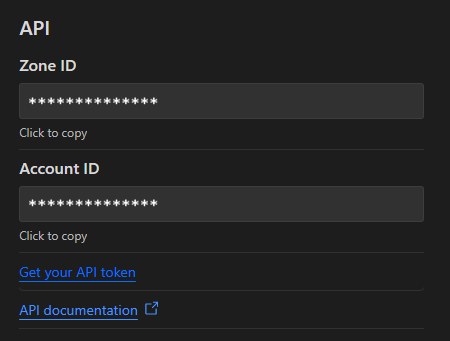

# @alienkarma/cloudflare-kv-wrapper


A javascript/typescript wrapper for Cloudflare's KV namespaces using REST API.
This helps access Cloudflare's KV data stores directly without requiring CF workers or Wrangler.

<br />

## 👇 Table of contents:-

- [📐 Pre-requisites](#-pre-requisites)
- [🚀 Get started](#-get-started)
- [🦾 API](#-api)

<br />

## 📐 Pre-requisites

- Account ID:
  - Go to https://dash.cloudflare.com/
  - Select an account and a website
  - Scroll to the bottom right side of the page
  - Your account ID will be visible (as shown in the image)
- Auth Token:
  - Click on "Get your API token" (as shown in the image)
  - Click on "Create Token" and use the template "Edit Cloudflare Workers"
  - Optionally, customize the settings as needed (zone restrictions, TTL, etc)
  - Once done, note down the API token

> ❕ **NOTE**: It is better to store the account ID and auth token credentials as part of your .env file and use it from there securely.

<br />



<br />

## 🚀 Get started

Install package via npm

```bash
npm install cloudflare-kv-wrapper
```

<br />

Import the appropriate module for use.
You can also import their relevant types.

<p><strong>Namespaces</strong>
Used for handling KV namespaces. It is best to create a namespace from the cloudflare dashboard and use its ID directly in your code</p>

```ts
import { ns } from "cloudflare-kv-wrapper";
import type { NSTypes } from "cloudflare-kv-wrapper";
```

<br />

<strong>KV Pair</strong>

<p>Used for managing a single key-value pair.</p>

```ts
import { kv } from "cloudflare-kv-wrapper";
import type { KVTypes } from "cloudflare-kv-wrapper";
```

<br />

<strong>KV Pair (Multi)</strong>

<p>Used for managing key-value pairs in bulk.</p>

```ts
import { kvm } from "cloudflare-kv-wrapper";
import type { KVMTypes } from "cloudflare-kv-wrapper";
```

<br />

And that is it!
You can start using KV namespaces and their KV pairs.
For usage examples, check out the [/example](/example) folder.

<br />

## 🦾 API

All functions are async functions and are fully type-supported. Each function's source API link is attached as well for further queries.

### Namespaces : create [[source]](https://developers.cloudflare.com/api/operations/workers-kv-namespace-create-a-namespace)

<p>Creates a namespace under the given title. A 400 is returned if the account already owns a namespace with this title. A namespace must be explicitly deleted to be replaced.</p>

```typescript
ns.create();

// Parameters
NSTypes.Create {
  accountId: string;
  authToken: string;
  title: string;
}

// Response
NSTypes.CreateResponse {
  errors: Message[];
  messages: Message[];
  success: boolean;
  result: {
    id: string;
    supports_url_encoding: boolean;
    title: string;
  };
}
```

### Namespaces : get [[source]](https://developers.cloudflare.com/api/operations/workers-kv-namespace-get-a-namespace)

<p>Get the namespace corresponding to the given ID.</p>

```typescript
ns.get();

// Parameters
NSTypes.Get {
  accountId: string;
  authToken: string;
  namespaceId: string;
}

// Response
NSTypes.GetResponse {
  errors: Message[];
  messages: Message[];
  success: boolean;
  result: {
    id: string;
    supports_url_encoding: boolean;
    title: string;
  };
}
```

### Namespaces : list [[source]](https://developers.cloudflare.com/api/operations/workers-kv-namespace-list-namespaces)

<p>Returns the namespaces owned by an account.</p>

```typescript
ns.list();

// Parameters
NSTypes.List {
  accountId: string;
  authToken: string;
}

// Response
NSTypes.ListResponse {
  errors: Message[];
  messages: Message[];
  success: boolean;
  result: {
    namespaces: {
      id: string;
      title: string;
    }[];
  };
}
```

### Namespaces : remove [[source]](https://developers.cloudflare.com/api/operations/workers-kv-namespace-remove-a-namespace)

<p>Deletes the namespace corresponding to the given ID.</p>

```typescript
ns.remove();

// Parameters
NSTypes.Remove {
  accountId: string;
  authToken: string;
  namespaceId: string;
}

// Response
NSTypes.RemoveResponse {
  errors: Message[];
  messages: Message[];
  success: boolean;
}
```

### Namespaces : rename [[source]](https://developers.cloudflare.com/api/operations/workers-kv-namespace-rename-a-namespace)

<p>Modifies a namespace's title.</p>

```typescript
ns.rename();

// Parameters
NSTypes.Rename {
  accountId: string;
  authToken: string;
  namespaceId: string;
  title: string;
}

// Response
NSTypes.RenameResponse {
  errors: Message[];
  messages: Message[];
  success: boolean;
  result: {
    id: string;
    supports_url_encoding: boolean;
    title: string;
  };
}
```

### KV Pair : list [[source]](https://developers.cloudflare.com/api/operations/workers-kv-namespace-list-a-namespace'-s-keys)

<p>Lists a namespace's keys.</p>

```typescript
kv.list();

// Parameters
KVTypes.List {
  accountId: string;
  authToken: string;
  namespaceId: string;
}

// Response
KVTypes.ListResponse {
  errors: Message[];
  messages: Message[];
  success: boolean;
  result: {
    keys: string[];
  };
}
```

### KV Pair : metadata [[source]](https://developers.cloudflare.com/api/operations/workers-kv-namespace-read-the-metadata-for-a-key)

<p>Returns the metadata associated with the given key in the given namespace. Use URL-encoding to use special characters (for example, :, !, %) in the key name.</p>

```typescript
kv.metadata();

// Parameters
KVTypes.Metadata {
  accountId: string;
  authToken: string;
  namespaceId: string;
  key: string;
}

// Response
KVTypes.MetadataResponse {
  errors: Message[];
  messages: Message[];
  success: boolean;
  result: {
    expiration: string;
    expiration_ttl: number;
    key: string;
    metadata: {
      [key: string]: string;
    };
  };
}
```

### KV Pair : read [[source]](https://developers.cloudflare.com/api/operations/workers-kv-namespace-read-key-value-pair)

<p>Returns the value associated with the given key in the given namespace. Use URL-encoding to use special characters (for example, :, !, %) in the key name. If the KV-pair is set to expire at some point, the expiration time as measured in seconds since the UNIX epoch will be returned in the expiration response header.</p>

```typescript
kv.read();

// Parameters
KVTypes.Read {
  accountId: string;
  authToken: string;
  namespaceId: string;
  key: string;
}

// Response
KVTypes.ReadResponse {
  errors: Message[];
  messages: Message[];
  success: boolean;
  result: {
    expiration: string;
    expiration_ttl: number;
    key: string;
    value: string;
  };
}
```

### KV Pair : write [[source]](https://developers.cloudflare.com/api/operations/workers-kv-namespace-write-key-value-pair-with-metadata)

<p>Write a value identified by a key. Use URL-encoding to use special characters (for example, :, !, %) in the key name. Body should be the value to be stored along with JSON metadata to be associated with the key/value pair. Existing values, expirations, and metadata will be overwritten. If neither expiration nor expiration_ttl is specified, the key-value pair will never expire. If both are set, expiration_ttl is used and expiration is ignored.</p>

```typescript
kv.write();

// Parameters
KVTypes.Write {
  accountId: string;
  authToken: string;
  namespaceId: string;
  key: string;
  value: string;
  metadata: {
    [key: string]: string;
  };
  expiration?: string;
  expiration_ttl?: number;
}

// Response
KVTypes.WriteResponse {
  errors: Message[];
  messages: Message[];
  success: boolean;
}
```

### KV Pair : remove [[source]](https://developers.cloudflare.com/api/operations/workers-kv-namespace-delete-key-value-pair)

<p>Remove a KV pair from the namespace. Use URL-encoding to use special characters (for example, :, !, %) in the key name.</p>

```typescript
kv.remove();

// Parameters
KVTypes.Remove {
  accountId: string;
  authToken: string;
  namespaceId: string;
  key: string;
}

// Response
KVTypes.RemoveResponse {
  errors: Message[];
  messages: Message[];
  success: boolean;
}
```

### KV Pair (Multi) : write [[source]](https://developers.cloudflare.com/api/operations/workers-kv-namespace-write-multiple-key-value-pairs)

<p>Write multiple keys and values at once. Body should be an array of up to 10,000 key-value pairs to be stored, along with optional expiration information. Existing values and expirations will be overwritten. If neither expiration nor expiration_ttl is specified, the key-value pair will never expire. If both are set, expiration_ttl is used and expiration is ignored. The entire request size must be 100 megabytes or less.</p>

```typescript
kvm.write();

// Parameters
KVMTypes.Write {
  accountId: string;
  authToken: string;
  namespaceId: string;
  keys: string[];
}

// Response
KVMTypes.WriteResponse {
  errors: Message[];
  messages: Message[];
  success: boolean;
  result: {
    keys: {
      key: string;
      value: string;
    }[];
  };
}
```

### KV Pair (Multi) : remove [[source]](https://developers.cloudflare.com/api/operations/workers-kv-namespace-delete-multiple-key-value-pairs)

<p>Remove multiple KV pairs from the namespace. Body should be an array of up to 10,000 keys to be removed.</p>

```typescript
kvm.remove();

// Parameters
KVMTypes.Remove {
  accountId: string;
  authToken: string;
  namespaceId: string;
  keys: string[];
}

// Response
KVMTypes.RemoveResponse {
  errors: Message[];
  messages: Message[];
  success: boolean;
}
```

<br />

If you face any issues, raise a request and I will try my best to solve it.
Enjoy! 👍

```

```
